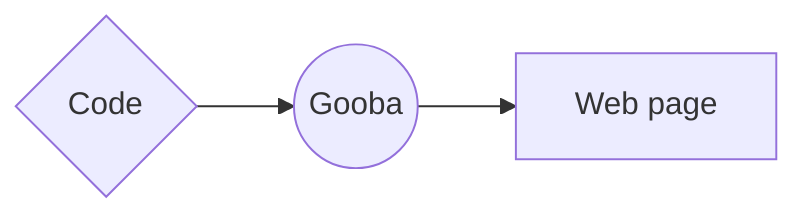

# How Gooba Interprets Code

Gooba is designed to help developers write clean Python code that gets compiled into web code, such as HTML, CSS, and JavaScript. The general workflow is:

1.  **Write Code in Gooba**: Developers write Python code using Gooba's built-in classes and methods to create web elements, styles, and interactive features.
    
2.  **Gooba Interpreter**: Gooba acts as a bridge that takes the Python code and converts it into the necessary web technologies like HTML, CSS, and JavaScript.
    
    -   **HTML Generation**: Gooba parses the structure of the document, creates elements (e.g., `CreateElement("div")`), and converts them into standard HTML tags.
    -   **CSS Styles**: If any styles are defined, such as inline styles or through the `CreateStyle()` class, Gooba translates these into standard CSS. This can be embedded directly in the HTML or exported as an external CSS file.
    -   **JavaScript**: Interactive elements such as forms, buttons, or any other dynamic content are converted into JavaScript code to handle events and behaviors.
3.  **Output HTML, CSS, and JavaScript**: After interpreting the Gooba code, the system outputs:
    
    -   **HTML** for structuring the web page.
    -   **CSS** for styling the web page.
    -   **JavaScript** for handling interactions.

## Example Workflow

Consider the following Gooba code:

	from GooBa import Document, CreateElement, CreateStyle

	# Create a new document
	doc = Document()

	# Create a paragraph element
	paragraph = CreateElement("p", className="text-muted")
	paragraph.text = "This is a Gooba paragraph."

	# Create a style for the paragraph
	style = CreateStyle()
	style.style(".text-muted", {
	    "color": "gray",
	    "font-size": "18px"
	})

	# Add everything to the document
	doc.title("Gooba Page")
	doc.appendHead(style)
	doc.body(paragraph)

	# Generate the HTML/CSS
	doc.build()

### Gooba Processes the Code:

-   **Step 1**: The `Document` object creates the basic structure of the HTML page.
-   **Step 2**: `CreateElement` is used to define an HTML element like a paragraph (`
`).
-   **Step 3**: `CreateStyle` is used to apply CSS styles, which will be either embedded in the HTML or saved as an external CSS file.
-   **Step 4**: The `doc.build()` method compiles the Gooba code into:

**HTML Output**:

	<!DOCTYPE html>
	<html>
	<head>
	    <title>Gooba Page</title>
	    
	</head>
	<body>
	    
This is a Gooba paragraph.

	</body>
	</html>

**CSS Output** (if using external CSS):

	.text-muted {
	    color: gray;
	    font-size: 18px;
	}

